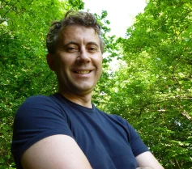

Hi, my name is Marco, I am an expert in Digital Transformation and Innovation Management with more than 25 years of experience in project management, research management, and digital transformation consulting.

### Short Bio
I am the owner of [TOOL80 srl](https://www.tool80.it), a small company providing consultancy in the field of digital encoding, associate with [MPAI Community](https://mpai.community), an international non-profit organisation with the mission is to develop Artificial Intelligence (AI) enabled digital data compression specifications.

I am also as freelance an indipendent scientific and technology consultant, providing support to [EU Commission](https://commission.europa.eu/about-european-commission/departments-and-executive-agencies/informatics_en) collaborating with the [Unit T.1 - Joint Research Center in Ispra](https://op.europa.eu/en/web/who-is-who/organization/-/organization/JRC/COM_CRF_18002) in doing research about the adoption of digital technologies jointly with the Public Sector Technology Watch observatory estabilished by EC and publishing reports like this [one](https://publications.jrc.ec.europa.eu/repository/handle/JRC129301)

### Competence
I am an expert in digital transformation, in particular in the public sector. Distributed systems, artificial intelligence, blockchain, data science, and several types of digital public service implementation. 
I worked and I still work with data (hopefully open) and several software applications applying open innovation and co-design principles in many different public sector projects.. trying to hack the bureaucracy as much as I could. I have a software engineering background and I am a technology lover, but I developed my career mainly as a consultant, starting with big brands (Telecom and then Microsoft) and going around in several places, not only in Italy. Finally, in 2008, I landed in Trentino, where I set up the family, and I happily stayed there in the heart of the European Alps, in a very nice place to live.

### Interests
I have several interests, and I like everything that could be considered “new” even if I don’t disregards the past, history and philosophy, and all that other people did in the past. 
I like politics, and I think everybody must contribute to our democracy, to keep it up and running, to shake away populism and demagogies
social life, new technology, music, cinema, arts… I like everything hides passion and bright ideas. 
I love future and I need to think about the future.. I don’t want to be dominated by fears.. of any kind. 
Humanity is not negative or positive, it is, and so it goes.

### Links
- [X.Twitter](https://twitter.com/marcomb)
- [Linkedin](https://www.linkedin.com/in/marcomb/)
- [Google Scholar](https://scholar.google.com/citations?user=VA6U5LgAAAAJ&hl=en)
- [Facebook](https://www.facebook.com/marcomb)
- [YouTube](https://www.youtube.com/channel/UCW5EnzxpFCW1Wh2t8kYq0_w)
- [Personal Blog on Wordpress](https://marcomb.wordpress.com/)

### Contacts
- email: marcomb@hotmail.com
- mobile: +393316329971

<footer>

&copy; 1969-2023 Marco Combetto 

</footer>

