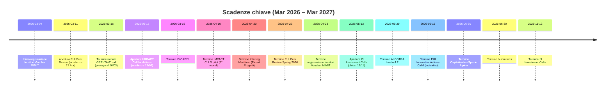

# Opportunità di finanziamento UE e Coesione per una PMI GovTech a Trento

## Executive summary

- **Urban funds ERDF**: EUI – Innovative Actions Call 4 (chius. ~15/06/2026) con 60M€【21†L1-L4】. Richiede lead PA (città), utile per soluzioni SPID/IO, platf. dati, AI-servizi.  
- **Interreg Spazio Alpino**: call Capitalisation (deadline 30/06/2026)【46†L1-L5】. Trento ammissibile (NUTS2 ITH2). Progetti transnazionali digitali-sostenibili (mobilità intelligente, servizi PA smart).  
- **INTERREG CBC**: ALCOTRA bando4.2 (scad. 29/05/2026)【24†L1-L4】 con OS digitalizzazione; partecipazione indiretta. Marittimo e Grecia–Italia call attuali (aprile/marzo 2026) out-of-area per Trento – da monitorare come subappalto.  
- **Voucher cloud/cyber (MIMIT)**: registrazione fornitori 4/03–23/04/2026【4†L1-L7】. Budget 150M€, voucher fino a 20k€. OpenCity Labs deve accreditarsi e proporre pacchetti SPID/IO e sicurezza.  
- **PNRR compliance**: SUAP/SUE (scadenza 26/02/2026)【33†L1-L3】 e Minerva HR (deadline 23/02/2026)【39†L1-L4】 – non bandi aperti per PMI, ma generano gare ICT (integrazioni interoperabili).  
- **FESR Trentino**: Avviso 1/2026 infrastrutture sperimentazione (3M€)【18†L1-L5】. Aprire per soluzioni pilota come *digital twin* urbano, piattaforme dati multi-ente. Avviso 1/2024 manager (open)【45†L1-L4】 per inserire competenze IA/Cyber nelle PMI.  
- **ESF+ Trentino**: formazione continua (fino 30/04/2027, 7,1M€)【20†L1-L3】, e supporto all’innovazione (bandi voucher); utile per upskill interni su tech digitali.  
- **Opportunità indotte**: b-solutions (DG REGIO, scadenza 30/06/2026)【12†L1-L4】 e IMPACT CLLD (10/04/2026)【32†L1-L3】 – supporto tecnico PA transfrontaliere, possibili sviluppo tool civic-tech come subappalto.  
- **Priorità operative**: (1) accreditarsi al Voucher MIMIT; (2) candidare partner PA locali su EUI-IA e Spazio Alpino; (3) preparare proposta infrastruttura dati/pilot FESR 1/2026; (4) offrire servizi compliance PNRR (SUAP/SUE, Minerva); (5) partecipare ai network URBACT e capacity building EU (peer review, City-to-City).  

## Tabella delle opportunità

| Programma e bando                             | Soggetto gestore                | Scadenza      | Area geografica (Trento?)       | Tipo         | Budget/primo contributo (€) | Beneficiari/Partnership        | Rilevanza (1-5) / Azionabilità (1-5) | Note/Rischi            |
|----------------------------------------------|---------------------------------|---------------|--------------------------------|--------------|-----------------------------|--------------------------------|-------------------------------------|------------------------|
| **EUI Innovative Actions (Call 4)**          | Commissione europea (DG REGIO)  | 15/06/2026    | UE (città) *Trento eleggibile*  | Grant ERDF    | ~60M€ (2M€ max/project)【21†L1-L4】 | Città (lead), partner multi-actor | Tech 5 / Az 5                      | Lead PA richiesto       |
| **EUI City-to-City Exchanges**               | Commissione europea (DG REGIO)  | Continuo      | UE (città) *Trento eleggibile*  | Capacity bldg | n.d.                        | Città (lead), partner PA        | Tech 3 / Az 4                      | Partecipazione indiretta|
| **URBACT Call for Actions**                  | URBACT (Regioni EU)             | 17/06/2026    | UE (reti urbane) *Trento ok*    | Grant ERDF    | non specificato              | Reti di città (lead PA)        | Tech 4 / Az 4                      | Lead PA richiesto       |
| **Interreg Spazio Alpino – Capitalisation**  | Progr. Spazio Alpino (JS)       | 30/06/2026    | NUTS3 Alpino (Trento ok)        | Grant ERDF    | 1M€ per progetto【46†L1-L5】    | Parten. transnazionale (PA, ricerca) | Tech 4 / Az 4                   | Consorzio ampio         |
| **Interreg ALCOTRA (bando4.2)**              | Regione AURA                       | 29/05/2026    | CBC Italia-Francia (Trento **no**) | Grant ERDF    | ~26M€ totale【24†L1-L4】       | PA transfrontaliere (subappalto) | Tech 4 / Az 3                      | Solo subappalto        |
| **Interreg Marittimo (Piccoli Progetti)**    | Regione Toscana                  | 20/04/2026    | CBC Marittimo (Trento **no**)   | Grant ERDF    | 3,576,881.25€ totale【28†L1-L5】 | PA transfrontalieri (subappalto) | Tech 2 / Az 3                      | Solo subappalto        |
| **Interreg GRE-ITA (6th Call)**             | Programma GRE-ITA (MA Grecia)    | 16/03/2026    | CBC Grecia-Italia (Trento **no**) | Grant ERDF    | 9M€【29†L1-L3】                 | PA (subappalto)               | Tech 3 / Az 2                      | Solo subappalto        |
| **b-solutions (dg REGIO)**                  | Commissione europea (DG REGIO)  | 30/06/2026    | Regioni confine (Trento *ok*)   | Assistenza TA | –                           | Enti pubblici transfrontalieri  | Tech 2 / Az 3                      | Supporto legale, non grant |
| **IMPACT CLLD pilots**                       | Commissione europea (DG REGIO)  | 10/04/2026    | Regioni confine UE (Trento *ok*) | Assistenza TA | –                           | PA locali, LAG, EGTC           | Tech 2 / Az 3                      | Solo per progetti CLLD |
| **I3 Capacity Building (2026)**             | EISMEA (EU Innovation)          | 19/03/2026    | UE (specialisti PA)             | Grant ERDF    | 9.8M€【37†L1-L5】               | Intermediari innovazione, cluster | Tech 3 / Az 3                   | Target cluster/S3      |
| **I3 Investment Call (2026)**               | EISMEA                           | 12/11/2026    | UE                              | Grant ERDF    | non specificato (multiml€)     | Consorzi interregionali        | Tech 4 / Az 3                      | Consorzi complessi    |
| **Voucher Cloud/Cyber (MIMIT)**            | MIMIT (Invitalia)                | 23/04/2026    | Italia                            | Voucher      | 150M€ totali【4†L1-L7】         | PMI (crediti digitali)         | Tech 4 / Az 5                      | Preregistrazione forn. |
| **PNRR – SUAP/SUE (adeguamento)**           | Dip. Funz. Pubblica / Invitalia   | 26/02/2026    | Italia (enti locali)             | Procurement   | 120M€ totali (stima)          | PA esistenti                   | Tech 5 / Az 4                      | Gare segmentate      |
| **PNRR – Minerva (HR interoper.)**         | Dip. Funz. Pubblica             | 23/02/2026    | Italia (PA centrali/loc.)       | Procurement   | 58.6M€ (budget)【39†L1-L4】      | PA finanziate                  | Tech 4 / Az 3                      | Gare multiple       |
| **FESR Trentino 1/2026 (Infrastrutture)** | PAT (APIAE)                      | stim. mar 2026 | Trentino-Alto Adige (Trento ok)  | Grant FESR    | 3M€【18†L1-L5】                | Imprese (anche grandi)        | Tech 4 / Az 4                      | Avviso atteso       |
| **FESR Trentino 1/2024 (Manager PMI)**    | PAT (Trentino Sviluppo)          | aperto        | Trentino-Alto Adige (Trento ok)  | Grant FESR    | non specificato               | PMI (inc. OpenCity Labs)      | Tech 3 / Az 4                      | Sportello continuo  |
| **FSE+ Trentino – Formazione continua**   | PAT (Agenzia Lavoro)             | 30/04/2027    | Trentino-Alto Adige (Trento ok)  | Grant FSE+    | 7,1M€ (gestione)【20†L1-L3】     | PA, imprese, terzo settore    | Tech 2 / Az 4                      | Progetti formativi |
| **CCIAA Trento – Bando Energia/Digitale** | Camera di Commercio TN           | stimato 2026   | Provincia TN (Trento ok)         | Voucher       | 550K€【3†L1-L4】                | Micro/PMI provincia trentina  | Tech 3 / Az 3                      | Apertura da definire |

(*) **Legenda**: [LEAD-PA] = richiede ente pubblico capofila; [INDIRECT] = PMI solo come partner tecnico; [NOT-DIGITAL] = tema non ICT ma possibile contributo digitale.

## Top 10 opportunità più azionabili

1. **Voucher Cloud/Cyber (MIMIT)** – **(Az. 5/5)** Immediato: registrarsi come fornitore【4†L1-L7】. Alta coerenza tecnologica.  
2. **EUI Innovative Actions (Call 4)** – **(5/5)** Grande finanziamento (60M€) e tema centrale per GovTech. Partecipazione conente.  
3. **Interreg Spazio Alpino (Capitalisation)** – **(4/5)** Progetto concreto in area Trento; budget garantito e alta rilevanza digitale.  
4. **PNRR – SUAP/SUE** – **(4/5)** Impegni a breve termine (feb26); forte domanda di integrazioni SPID/IO, piattaforme dati per Comuni.  
5. **FESR Trentino 1/2026** – **(4/5)** Finanziamento concreto (3M€); progettare subito una piattaforma di test per smart city / AI.  
6. **I3 Capacity Building (CAP2b)** – **(3/5)** 9.8M€, utile per inserirsi come esperti/dimostratori in ecosistemi innovazione.  
7. **ESF+ Formazione (TN)** – **(4/5)** Utilizzare per formazione avanzata su piattaforme digitali interne. Facile da attivare.  
8. **FESR Manager PMI (TN)** – **(4/5)** Finanziamento facile per inserire figure tecniche (cyber, AI).  
9. **URBACT Call for Actions** – **(4/5)** Apertura 17/03/26; possibili partnership con città italiane.  
10. **PNRR – Minerva (HR)** – **(3/5)** Budget alto; progetti in corso, necessità di fornitori per sistemi interoperabili.

## Programmi da monitorare

- **Interreg Central Europe** – include Trentino (NUTS2 ITH2【6†L1-L5】). Attenzione a futuri bandi (non ce ne sono nell’immediato).  
- **Interreg Europe** – misure politiche transregionali; future call per progetti pilota o policy learning (su piattaforme dati, AI).  
- **FESR regionale** – altri avvisi 2026 come digitalizzazione impresa o innovazione smart city (verificare calendario PAT).  
- **Appalti-Innovativi (PNRR)** – progetti pilota digitali per PA (es. smart urban). Monitorare nuove opportunità DA digitale/MIMIT.  

## Timeline prossimi 12 mesi

## Azioni consigliate

1. **Registrazione Voucher MIMIT**: completare preregistrazione come fornitore entro 04/03/2026【4†L1-L7】 e predisporre pacchetti SaaS cloud/cyber integrabili con SPID/IO, pagoPA.  
2. **Proposte con PA locali**: contattare Comuni/Province del Trentino per candidarsi co-lead su EUI-IA e URBACT (inserendo OpenCity Labs come partner tecnologico). Preparare concept di progetto smart city.  
3. **Bando FESR 1/2026 (Trentino)**: elaborare immediatamente un progetto infrastrutturale (es. laboratorio digitale urbano con IoT, AI, open data) e verificare requisiti fine marzo 2026.  
4. **Offerta di compliance PNRR**: proporre servizi integrati per SUAP/SUE e Minerva alle PA trentine (audit, integrazioni, supporto tecnico) prima delle scadenze d.imposta (26/02/2026 e 23/02/2026).  
5. **Attività di capacity building**: utilizzare bandi ESF+ locali per formare il team su tecnologie emergenti (data analytics, AI, cybersecurity) per essere pronti alle gare digitali.  
6. **Monitor continuo**: tenere d’occhio aperture di bandi FESR regionali e nuove edizioni INTERREG (es. Central Europe, Europe, CBC) e aggiornamenti portale PA digitale.  

## Fonti utilizzate

- Commissione Europea – European Urban Initiative, Call 4 (Informazioni e linee guida)【21†L1-L4】  
- Commissione Europea – EUI City-to-City Exchanges (invito  continuo)【20†L1-L3】  
- URBACT – Call for Actions 2026 (annuncio del programma e date)【52†L1-L3】  
- Programma Interreg Spazio Alpino – bando Capitalisation (scadenza e budget)【46†L1-L5】  
- Interreg Italia-Francia ALCOTRA – Quarto Bando Finestra 2 (obiettivi e budget)【24†L1-L4】  
- Interreg Italia-Francia Marittimo – IV Avviso Piccoli Progetti (avviso ufficiale)【28†L1-L5】  
- Programma Interreg Grecia-Italia – Call 6 (annuncio con budget 9M€)【29†L1-L3】  
- Commissione Europea – b-solutions, call estesa al 30/06/2026【12†L1-L4】  
- Commissione Europea – IMPACT CLLD pilot, call 10/04/2026【32†L1-L3】  
- EISMEA – I3 CAP2b Call 2026 (info programma, budget 9,8M€)【37†L1-L5】  
- EISMEA – I3 Investment Calls 2026 (date apertura e chiusura)  
- Ministero Imprese e Made in Italy (MIMIT) – Voucher Cloud/Cybersecurity (dotazione 150M€, registrazione fornitori)【4†L1-L7】  
- Invitalia – istruzioni adeguamento SUAP/SUE (scadenza 26/02/2026)【33†L1-L3】  
- Dip. Funz. Pubblica – elenco PA ammesse Minerva (dotazione 58,6M€)【39†L1-L4】  
- PAT – Avviso FESR 1/2026 infrastrutture (3M€, beneficiari)【18†L1-L5】  
- PAT – Avviso FESR 1/2024 inserimento manager (apertura, beneficiari)【45†L1-L4】  
- PAT – Avviso ESF+ Formazione Continua (7,1M€, scadenza 30/04/2027)【20†L1-L3】  
- CCIAA Trento – Schema Bando 2026 Energia/Digitale (550K€, 70% contributo)【3†L1-L4】  

