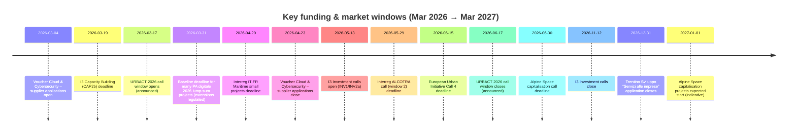

# Additional EU and Cohesion funding opportunities for an Italian GovTech SME in Trento

## Executive summary

- The most time-critical **grant** opportunities in the next 3–4 months are **entity["organization","European Urban Initiative","eui innovative actions call 4"] Call 4** (deadline **15 June 2026**) and **entity["organization","Interreg Alpine Space Programme","2021-2027"] **Capitalisation projects** (deadline **30 June 2026**). citeturn41view0turn28search1  
- The most immediately actionable **market-entry mechanism** for an IT provider is the **entity["organization","Ministero delle Imprese e del Made in Italy","italy ministry"] Voucher Cloud & Cybersecurity**: supplier preregistration is active and formal supplier applications run **4 March–23 April 2026**. citeturn26view0  
- For **URBACT**, a new call is scheduled **17 March–17 June 2026** (details in the forthcoming ToR). This is strongly “city-led”; the realistic entry path for an SME is typically via **city partners** and procurement/subcontracting. citeturn29search1turn28search2  
- **INTERREG cross‑border Italië–Austria** does **not** include Trento among the eligible Italian NUTS3 areas (it includes Bolzano and specific Veneto/FVG provinces). Moreover, the **third and final** call closed in July 2025. For a Trento-based SME, this is now mainly a **subcontracting/procurement pipeline** via approved projects, not a direct call. citeturn19search18turn28search24  
- Within INTERREG transnational eligibility, Trento is clearly in-scope for **Central Europe** and **Alpine Space** programme areas at NUTS2 level. citeturn29search2turn19search24  
- In Trentino’s Cohesion programmes, the key near-term ERDF lever is the **FESR Avviso 2026‑1** (new **test/experimentation infrastructures**), expected to start **March 2026** with a **€3m** envelope (until budget exhaustion). citeturn22search8turn22search0  
- On the ESF+ side, a highly accessible instrument is the **continuous training call** open until **30 April 2027** (budget **€7.1m**), usable to upskill AI/cyber/interoperability capacity or formalise training services. citeturn31view0  
- **PNRR digital calls on PA digitale 2026 are currently closed** (“no calls open at the moment”), but implementation is active and procurement demand remains high; extensions beyond **31 March 2026** are regulated (Decree 29/2026-PNRR). citeturn28search0turn28search8  
- Two PNRR implementation tracks are especially aligned with GovTech interoperability vendors: **SUAP/SUE digitalisation (2.2.3)** and **interoperability of PA HR systems with Minerva** (calls closed, but execution/procurement is happening now). citeturn40search9turn7search13  
- The best “EU-wide, non‑Horizon” grant instrument for scaling interregional value-chain innovation remains **entity["organization","Interregional Innovation Investments Instrument","i3 instrument"] (I3)**: capacity building deadline **19 March 2026**, and the investment calls open **13 May 2026**. citeturn18search0turn18search1  

## Eligibility map for Trento and Trentino in INTERREG and Cohesion instruments

### Where Trento-based organisations are eligible as beneficiaries

Trento-based organisations (including SMEs) have clear geographic eligibility for the following INTERREG strands/programmes:

- **Transnational**: **Central Europe** explicitly lists **Provincia Autonoma di Trento (ITH2)** in the programme area. citeturn29search2turn29search6  
- **Transnational**: **Alpine Space** programme area explicitly includes **Provincia Autonoma di Trento (ITH2)** among Italian eligible NUTS2 territories. citeturn19search24turn29search3  
- **Interregional**: **Interreg Europe** covers EU-wide interregional cooperation (Italy is eligible as EU27). citeturn25search23turn25search13  
- **Interregional urban**: **URBACT IV** covers EU27 (Italy included) and is explicitly positioned as an interregional cooperation programme for cities. citeturn25search1turn25search5  
- **Cohesion ERDF (regional)**: Trentino has its own **Programma FESR 2021–2027** with a stated overall envelope of **€181m**. citeturn20search6turn22search9  

### Where Trento-based SMEs are typically **not** eligible as direct beneficiaries

- **Interreg Italy–Austria CBC**: the eligible Italian areas are explicitly listed as **Bolzano** plus specific provinces in **Veneto** and **Friuli Venezia Giulia**; Trento (as NUTS3) is not listed. citeturn19search18turn19search30  
- The programme also states the **third and final call** closed on **1 July 2025**; there is no call pipeline left in 2026 under standard calls. citeturn28search24turn1view1  

## Detailed opportunity table

Interpretation: “Trento eligible” refers to eligibility **as direct beneficiary**; “indirect” refers to realistic participation as **supplier/subcontractor** to eligible public bodies or lead beneficiaries.

| Priority | Opportunity (programme + call) | Managing body | Scope & Trento eligibility | Status & dates | Funding type & indicative size | Applicants / partnership model | Fit for OpenCity Labs | Realistic role(s) for OpenCity Labs | Tech relevance (1–5) | Actionability (1–5) | Official source | Key risks / constraints (incl. flags) |
|---|---|---|---|---|---|---|---|---:|---:|---|---|
| **High** | **Programme:** European Urban Initiative  • **Call:** Innovative Actions Call 4 (2026) | **European Commission (DG REGIO)** + EUI entrusted entity (Hauts‑de‑France Region cited by DG REGIO) | **EU-wide. Trento eligible:** **Yes**, but **urban authority lead required** (≥25,000 inhabitants) | **Open:** 25 Feb 2026 • **Deadline:** 15 Jun 2026 | **ERDF grant** up to **€2m/project**, **80% co‑financing**; call budget ~**€60m** | **Lead:** urban authority/association of urban authorities; partners can include SMEs, research, NGOs; strong city operational piloting focus | Direct alignment with municipal SaaS, AI services, interoperability and citizen-facing platforms; “products/services/processes new to local context” are eligible | **Subcontractor/tech partner**, pilot developer, interoperability/data layer, AI-enabled service module, DMP & exploitation support | 5 | 5 | citeturn41view0 | **Flag: public authority lead.** Competitive; requires strong city coalition and robust transfer/scale plan; funding is not for pure procurement but for experimentation in municipal operations. |
| **High** | **Programme:** Interreg Alpine Space • **Call:** Capitalisation projects (current call) | Alpine Space programme authorities / Joint Secretariat | **Transnational Alpine area. Trento eligible:** **Yes** (programme area includes Provincia Autonoma di Trento at NUTS2) | **Open:** current • **Deadline:** 30 Jun 2026 (13:00 CET) • Decision Nov 2026 • Start Jan 2027 | **Interreg ERDF grant**: **€1m ERDF co‑financing per project**; partnerships 7–12, ≥4 countries; duration 24 months | Mixed consortia: public authorities, SMEs, universities, NGOs; must capitalise/transfer existing results, not greenfield R&D | Strong fit for interoperability, cross‑municipal platforms, data spaces, digital twins as “capitalisation/transfer” of proven solutions | Project partner for digital platform, data governance, interoperability architecture, replication toolkit, evaluation & exploitation | 4 | 4 | citeturn28search1turn19search24 | Not designed for large infrastructure investments; must evidence “capitalisation” and transnational replicability; consortium building overhead high. citeturn28search20 |
| **High** | **Programme:** URBACT IV • **Call:** 2026 Call (announced as “Call for Actions/Networks”) | URBACT programme governance / secretariat | **EU-wide urban networks. Trento eligible:** **Yes** (Italy eligible) | **Planned window:** 17 Mar 2026 → 17 Jun 2026 (details in ToR) | **ERDF grant (network-based)**; exact budget depends on ToR and network type | **Urban authorities are core beneficiaries;** SMEs typically participate as “non-city partners” or via local stakeholder groups / subcontracting | City-led integrated action planning and implementation support is relevant for civic tech and engagement platforms, especially if cities seek digital delivery of integrated plans | Subcontractor or “expert partner” for digital service design, open-source platforms, civic engagement tooling, data/interop | 4 | 4 | citeturn29search1turn28search2 | **Flag: public authority lead.** SMEs may be constrained by programme rules per network type; digital may be enabling rather than the official theme. |
| **High** | **Instrument:** I3 (Interregional Innovation Investments) • **Call:** I3‑2026‑CAP2b (Capacity Building Strand 2b) | **entity["organization","European Innovation Council and SMEs Executive Agency","eismea"]** | **EU-wide**, but Strand 2b targets capacity building for **less developed/transition regions**; Trento eligible **only if consortium includes and benefits LDR/TR regions** | **Open:** 23 Oct 2025 • **Deadline:** 19 Mar 2026 (17:00 CET) | **Grant 100% funding rate**; call budget **€9.8m**; typical project grant **€0.5m–€1.5m**; duration 18–24 months | Consortium must align with S3 regions and capacity building outcomes; no financial support to third parties | Fit if OpenCity Labs positions as capacity builder for GovTech ecosystems in transition/LDR regions (e.g., Southern Italy partners), preparing future investment proposals | Partner leading technical capacity building: interoperability standards, data governance, AI readiness, reusable GovTech components; dissemination/exploitation plans | 3 | 3 | citeturn18search0turn30view0 | **Constraint:** Trentino is “more developed”; this call expects strong LDR/TR relevance. Requires heavy consortium and policy linkage; not a short sales cycle. citeturn19search21turn30view0 |
| **High** | **National digital market enabler:** Voucher Cloud & Cybersecurity • **Supplier register window (providers)** | Ministry of Enterprises and Made in Italy, platform via Invitalia | Italy-wide. Trento eligible: **Yes** | **Supplier preregistration:** active from 27 Feb 2026 • **Supplier application window:** 4 Mar 2026 (12:00) → 23 Apr 2026 (12:00) | **Voucher scheme** (beneficiaries: SMEs/self-employed) • Total budget **€150m** | Two-sided: providers must be admitted to the ministerial supplier list; SMEs then request vouchers to buy eligible services | Direct commercial lever: register OpenCity Labs offerings (cloud/SaaS, security, workflow, AI features) and sell into subsidised demand | Register as supplier; package “cloud + security + AI-enabled workflow” bundles; also eligible as beneficiary for own cloud/security upgrades | 4 | 5 | citeturn26view0 | **Constraint:** voucher is for SME demand (not primarily PA). However it is a concrete route to subsidised sales; compliance and catalogue alignment needed. |
| **High** | **PNRR implementation pipeline:** SUAP/SUE digitalisation (Sub‑investment 2.2.3) • execution and contracting phase | **entity["organization","Invitalia","italian national investment agency"]** supporting Dipartimento della Funzione Pubblica | Italy-wide beneficiaries (Comuni/Associations/Enti Terzi). Trento eligible: **Indirect** (as supplier); direct beneficiary depends on being the public body | **Calls published Jul 2025; deadlines extended to Oct 2025**; execution guidance pushed in 2026; key operational milestones around Feb 2026 and beyond | **PNRR grant to public bodies**; practical opportunity for vendors is procurement for platform upgrades & interoperability | Municipalities/associations + “Enti Terzi” must upgrade platforms to technical interoperability specs; vendors provide compliant solutions | Strong match: SUAP/SUE back-office/front-office, interoperability, API layers, data management and citizen-facing portals | Supplier/subcontractor; pilot developer; interoperability and data integration expert; documentation & testing support | 5 | 4 | citeturn40search0turn40search9 | **Flag: SME participates indirectly** (procurement). Timelines are tight; procurement rules vary; require strong compliance with technical specifications and change management. |
| **High** | **Cohesion (FESR Trentino):** Avviso 2026‑1 “New test & experimentation infrastructures” | Autonomous Province of Trento (FESR programme); implementing offices include APIAE (per provincial governance) | **Trentino provincial territory. Trento eligible:** **Yes** | **Expected opening:** March 2026 • **Deadline:** until funds exhausted (per calendar entry) | **ERDF grant**; envelope **€3m** | Micro/SME/large enterprises eligible; infrastructures must be available to multiple users at market price (per press release) | Use to create or upgrade a “GovTech sandbox” / digital twin lab / interoperability testbed for municipalities and utilities in the province | Direct beneficiary; build shared test infrastructure; co-design with research bodies and pilot municipalities | 4 | 4 | citeturn22search8turn22search0 | Likely investment-heavy; must demonstrate multi-user access and market pricing; exact operational rules/TRL constraints must be checked in final call text. |
| **Medium** | **I3 Investment Calls (Strand 1 & 2a)** | EISMEA | EU-wide; Trento eligible **Yes**, but requires interregional investment consortia linked to S3 priorities | **Planned opening:** 13 May 2026 • **Closing:** 12 Nov 2026 | **ERDF-type innovation investment grants** (details per call) | Multi-region value-chain consortia; requires demonstrable interregional investment logic | Fit if OpenCity Labs can anchor a GovTech “interregional value chain” (e.g., interoperable municipal platforms, civic data spaces, AI for PA) with partners in other regions | Technical leader for platform architecture, interoperability and deployment; exploitation and scale plan owner | 4 | 3 | citeturn18search1 | High preparation load; strict interregional investment framing; requires strong regional innovation ecosystem backing and co-investment logic. |
| **Medium** | **ESF+ Trentino:** “Formazione continua” call (rolling) | Autonomous Province of Trento (FSE+); implementation via provincial systems | Trentino. Trento eligible: **Yes** | **Open:** 3 Mar 2025 • **Deadline:** 30 Apr 2027 (or budget exhaustion) | **ESF+ grant**; total budget **€7.1m**; max grant per proposal €50k (micro/small), €100k (medium), €200k (large) | Individual companies, ETS with economic activity, professionals; training must target workers/entrepreneurs in the province | Useful to fund structured training on AI engineering, security, interoperability standards, data governance; strengthen delivery capacity for PA projects | Direct beneficiary for internal workforce upskilling; or partner with training bodies to deliver PA-focused curricula (where allowed) | 3 | 4 | citeturn31view0 | Not a city-service grant; impact is indirect (capability building). Administrative burden (bimonthly evaluations, templates, digital signature, etc.). |
| **Medium** | **Local business innovation services:** “Servizi alle imprese” (Trentino Sviluppo) | **entity["organization","Trentino Sviluppo","development agency trentino"]** | Trentino economic system. Trento eligible: **Yes** (requires unità operativa in Trentino for paid services) | **Open for applications:** 12 Jan 2026 → 31 Dec 2026 | Service access with possible **de minimis** cost abatements; value depends on selected services | Single enterprise applications via portal; includes innovation process support, internationalisation, business development, etc. | Practical support mechanism (not a classic grant) to accelerate go‑to‑market, partnerships, and investment readiness relevant to municipal SaaS scaling | Applicant for subsidised services; also potential subcontractor if Trentino Sviluppo procures external expertise separately | 2 | 4 | citeturn37view0turn38view0 | Funding value is service-based (not cash); need to select services that materially de-risk the next 6–12 months (partnering, compliance, scale). |
| **Medium** | **Upcoming local voucher:** “Bando ESG, Energia e Digitale 2026” (scheme approved; final dates TBD) | **entity["organization","Camera di Commercio di Trento","chamber of commerce trento"]** (PID) | Trento province. Trento eligible: **Yes** (MPMIs with legal seat in province) | **Upcoming (2026):** scheme approved 26 Feb 2026; **submission dates not yet filled** in the published draft | Voucher-like contribution: budget **€550k**; **70%** of eligible costs up to **€9k** per firm; min €2k spend | Single enterprise; supports training/consulting on AI, cybersecurity, cloud, big data, process digitisation, etc. | Can fund targeted AI/cyber maturity improvements, certifications (e.g., ISO/IEC 27001) and capability upgrades supporting PA credibility | Direct beneficiary; also become “supplier” for other SMEs where rules allow (check provider eligibility clause) | 3 | 3 | citeturn35view0turn34view0 | Draft shows placeholders (“xx” dates); final call may set narrow windows and specific eligible providers; not dedicated to PA use-cases. |
| **Medium** | **Interreg Italia–Francia Marittimo 2021–2027:** IV call for “Piccoli progetti” (Priority 5 ISO6.3) | Programme authorities (call published on programme site) | Cross-border maritime area (Liguria, Toscana, Sardegna + FR territories). Trento eligible: **No** (direct); **Indirect** as supplier possible | **Open** • **Deadline:** 20 Apr 2026 (12:00) | Small grants; programme specifies small-scale projects (typical size €100k–€160k described in public summaries) | Mainly public bodies / public law bodies / non-profits; SMEs often not direct beneficiaries | Not digital by default (social cohesion / trust-building), but digital civic engagement platforms can enable cross-border participation | Subcontractor for engagement platform, multilingual participation tools, data and reporting, dissemination | 2 | 2 | citeturn18search3turn18search15 | **Flag: SME indirect only.** Low IT intensity; eligibility primarily for organisations in programme area; budgets small. |
| **Medium** | **Interreg Francia–Italia ALCOTRA 2021–2027:** 4th call (Window 2) | Programme authorities (published on programme site) | France–Italy Alpine border area. Trento eligible: **No** (direct) | **Open:** 1 Dec 2025 • **Deadline:** 29 May 2026 (12:00) | ERDF grant; envelope for the window referenced as ~€26m | Cross-border partnerships; typically public authority-led; SME participation varies by objective | Potentially relevant where “digitalisation” is an eligible thematic strand and municipalities seek digital platforms | Subcontractor/tech partner on pilots, interoperability components, data platforms and evaluation | 3 | 2 | citeturn18search2turn18search26 | **Flag: public authority lead likely / area restriction.** Trento-based SME participation is realistically via subcontracting to eligible beneficiaries. |
| **Monitor** | **Interreg Italy–Austria (CBC):** post-call project implementation market | Programme led by Bolzano managing structures | Border area; Trento eligible: **No** (direct) | No new calls (final call closed Jul 2025); 2026–2027 is implementation period | Procurement/subcontracting under approved projects | Beneficiaries in eligible provinces procure tech for pilots and platforms | Relevant if approved projects include digital transition, interoperability or citizen services | Subcontractor; platform provider; data management & dissemination | 3 | 2 | citeturn28search24turn19search18 | **Flag: SME indirect only.** Must track awarded projects and tender notices; language and procurement fragmentation across regions. |
| **Monitor** | **PA digitale 2026:** new PNRR lump-sum calls (if re-opened) | **entity["organization","Dipartimento per la trasformazione digitale","italy dtd"]** | Italy-wide. Trento eligible: depends on public authority beneficiary | **Currently:** no open calls; project deadlines/extensibility regulated | Lump-sum grants to public administrations; vendor opportunity via procurement | Municipalities procure services to meet funded milestones; DTD provides contracting templates and rules | Long-tail demand for SPID/IO/pagoPA integrations, migration, UX, interop and AI pilots | Supplier/subcontractor; delivery partner; compliance support | 5 | 3 | citeturn28search0turn28search8 | **Flag: SME indirect only.** Uncertain timeline for new calls; main opportunity is procurement for existing projects with tight compliance and verification. |

## Top 10 most actionable opportunities with rationale

**European Urban Initiative Call 4** is the highest-value near-term entry point because it targets **urban authorities piloting innovative solutions in daily municipal operations**, explicitly including digitalisation themes; OpenCity Labs fits as a specialised platform and interoperability provider. The deadline is fixed and close, forcing execution discipline. citeturn41view0  

**Interreg Alpine Space capitalisation call** is the best INTERREG route where a Trento-based SME is unquestionably eligible and digital transition is a legitimate axis; it favours transfer and reuse—aligned with an open-source municipal SaaS strategy. citeturn28search1turn19search24  

**URBACT 2026 call window (17 Mar–17 Jun 2026)** is a practical networking-to-project pipeline: even if the programme is city-led, it creates systematic demand for implementation support, digital co-creation tools, and citizen engagement platforms. citeturn29search1turn28search2  

**Voucher Cloud & Cybersecurity (supplier list)** is a concrete, low-latency mechanism: becoming an accredited supplier (March–April 2026 window) can unlock subsidised demand for cloud, cybersecurity, workflow and AI-enabled productivity services, supporting commercial scaling and compliance readiness. citeturn26view0  

**PNRR SUAP/SUE implementation market** is strategically aligned with OpenCity Labs’ interoperability and platform work: although the funding calls closed, the 2026 guidance and deadlines show an active execution phase where municipalities and “Enti Terzi” need compliant integrations. citeturn40search9turn40search0  

**PNRR interoperability of PA HR systems (Minerva integration)** is another interoperability-heavy execution stream: the selection phase closed, but 2026 acts confirm large-scale rollout, creating supplier demand for system integration and data interface work. citeturn7search13  

**FESR Trentino Avviso 2026‑1** is the strongest ERDF opportunity inside the province to build a reusable GovTech testbed (e.g., interoperability validation sandbox, AI service assurance lab, digital twin demonstrator), which can then support multi-municipality pilots and future EU proposals. citeturn22search8turn22search0  

**ESF+ Trentino continuous training** is a capability accelerator: it funds upskilling and formal training pathways, which directly improves eligibility and credibility in public-sector procurement (security, accessibility, AI governance, interoperability standards). citeturn31view0  

**I3 Capacity Building (19 Mar 2026)** is a focused EU call outside Horizon that can position OpenCity Labs as a capacity-building and standardisation actor for GovTech ecosystems; it is most viable if partnered with transition/less-developed regions and strong S3 alignment. citeturn18search0turn30view0  

**I3 Investment Calls (May–Nov 2026)** are the medium-term scale lever if OpenCity Labs can shape an interregional “GovTech value chain” investment narrative; high effort, but within 2026. citeturn18search1  

## Timeline of key deadlines in the next 12 months

Key dates below are taken from official sources where available; “estimated” indicates that the final call text was not yet published with fixed dates.

Supporting sources for the dated items: Voucher Cloud/Cybersecurity window citeturn26view0; I3 deadlines citeturn18search0turn18search1; URBACT window citeturn29search1; PA digitale baseline deadline context citeturn28search8; Marine/ALCOTRA deadlines citeturn18search3turn18search2; EUI deadline and call facts citeturn41view0; Alpine Space deadline citeturn28search1; Trentino Sviluppo closing citeturn37view0.  

## Programmes and pipelines to monitor

The following are relevant but either lack a credible fixed call date within 3–12 months or are mainly procurement pipelines for a Trento-based SME:

- **Interreg Central Europe**: Trento is eligible in the programme area, but there is no clearly announced call pipeline in 2026; monitor the programme’s call page and NCP communications. citeturn28search22turn29search2  
- **PA digitale 2026**: no open calls as of now; monitor for re-openings or new windows, but treat current value as procurement on existing projects and extension management. citeturn28search0turn28search8  
- **Interreg Italy–Austria**: monitor awarded project lists and tender notices for subcontracting; Trento is not an eligible NUTS3 beneficiary area and standard calls ended. citeturn19search18turn28search24  
- **Interreg Euro‑MED**: planned 2nd semester 2026 capitalisation calls exist in programme calendars; relevance depends on thematic focus and eligibility of potential lead partners. citeturn16search22  
- **Local voucher schemes** with draft approvals but missing fixed submission windows (e.g., the 2026 Chamber voucher is approved but still shows placeholder submission times in the published draft). citeturn35view0turn34view0  

## Concrete next steps for pursuing the top opportunities

- **EUI Call 4**: identify **2–3 target urban authorities** (including at least one medium city likely to lead) and propose a tightly scoped pilot package (citizen portal + interoperability layer + measurable KPI framework). Start with a “lead-authority brief” aligned to the six EUI thematic policy areas and the €2m/80% funding logic. citeturn41view0  
- **Alpine Space (capitalisation)**: approach existing Alpine consortia/results owners and pitch OpenCity Labs as the “replication and interoperability work package owner” (APIs, open-source reuse toolkit, data governance, exploitation plan). Book lead applicant consultations by the indicative internal timeline. citeturn28search1turn28search20  
- **URBACT 2026 call**: prepare an “URBACT-ready” offer (co-design workshops, civic engagement platform modules, accessibility-by-design, data-driven monitoring) and pre-position with 3–5 Italian municipalities that have prior URBACT participation. citeturn28search2turn29search1  
- **Voucher Cloud & Cybersecurity supplier list**: complete supplier preregistration and submit the supplier application within **4 Mar–23 Apr 2026**; define SKU-like offerings that match the eligible categories and document eligibility evidence. citeturn26view0  
- **PNRR SUAP/SUE and interoperability pipelines**: build a targeted municipal outreach list (Trentino + broader Italy) focusing on entities currently in contracting/implementation phases; offer compliance packages (technical specs + testing + documentation) and procurement-friendly statements of work. citeturn40search9turn7search13  
- **Cohesion in Trentino (FESR/FSE+)**: decide whether to pursue (a) a **FESR-funded testbed investment** to create a reference GovTech sandbox, and (b) a **FSE+ training track** to formalise AI/cyber/interoperability training capacity; align both to longer-term EUI/Interreg replication ambitions. citeturn22search0turn31view0  

## Sources used

Primary sources and official programme pages were prioritised:

- European Urban Initiative Call 4 (DG REGIO newsroom note with budget, eligibility, co-financing, deadline). citeturn41view0  
- Interreg Alpine Space “How to apply” (capitalisation call characteristics and deadline) and programme area documentation including Province-level eligibility. citeturn28search1turn19search24turn29search3  
- URBACT call window announcement (URBACT official pages). citeturn29search1turn28search2  
- I3 instrument official call page and call fiche (EISMEA + call document). citeturn18search0turn18search1turn30view0  
- Voucher Cloud & Cybersecurity official incentive page with supplier preregistration/application timeline and budget. citeturn26view0  
- Invitalia SUAP/SUE programme pages and 2026 operational guidance news. citeturn40search0turn40search9  
- Italian public administration interoperability HR systems selection decree notice (Dipartimento della Funzione Pubblica). citeturn7search13  
- PA digitale 2026 portal (current “no open calls” status; project timeline extension context). citeturn28search0turn28search8  
- Trentino FESR programme and Avviso 1/2026 communications + calendar snippet. citeturn22search9turn22search0turn22search8  
- Trentino ESF+ continuous training call (official service page with budget and dates). citeturn31view0  
- Trentino Sviluppo services call and full notice (dates and mechanism). citeturn37view0turn38view0  
- Interreg cross-border calls (ALCOTRA and IT‑FR Maritime) official call pages. citeturn18search2turn18search3  
- Interreg Italy–Austria eligible area definition and confirmation of final call closure. citeturn19search18turn28search24
